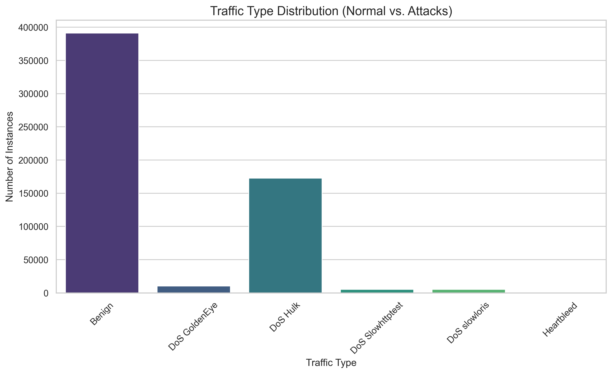
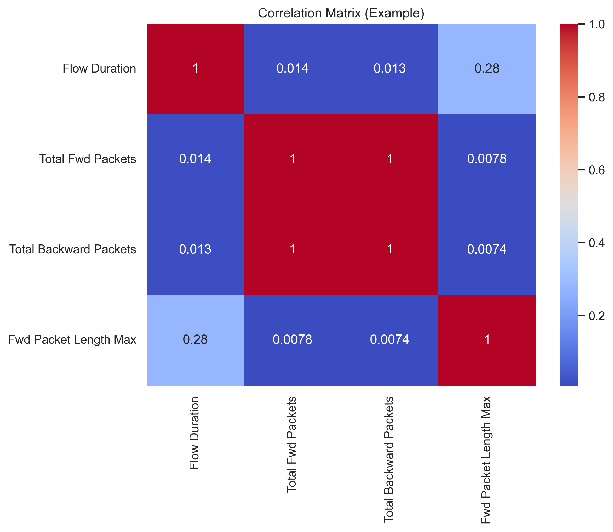
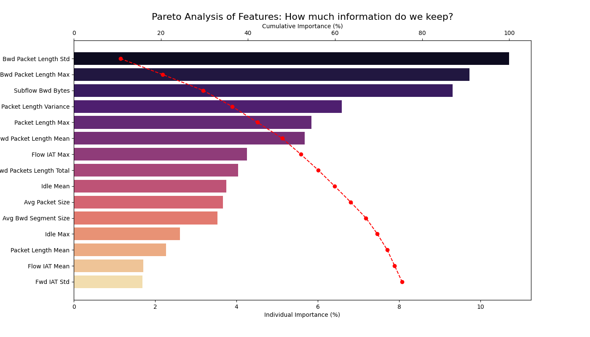
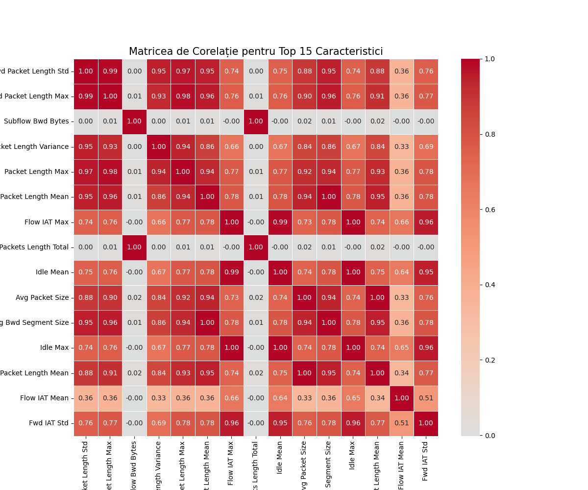

# ML-Based Intrusion Detection System (IDS)

This project focuses on developing a high-performance Intrusion Detection System (IDS) using Machine Learning to classify network traffic and detect malicious activities (DoS attacks) within a network environment.

## 📊 Project Progress
- [x] **Environment Setup:** Python 3.x, VS Code, and Virtual Environment (.venv).
- [x] **Data Ingestion:** Processed large-scale network traffic data using Parquet format for efficiency.
- [x] **Exploratory Data Analysis (EDA):** Analyzed class distributions and statistical properties.
- [x] **Feature Selection:** Performed dimensionality reduction using Variance Thresholding and Random Forest Importance.
- [ ] **Model Training:** (Upcoming) Supervised learning implementation.
- [ ] **Real-time Simulation:** (Upcoming) Testing the model against simulated live attacks.

---

## 🔍 Phase 1: Exploratory Data Analysis (EDA)

### Class Distribution (Target Imbalance)
The dataset reveals a significant class imbalance, a common challenge in Cybersecurity datasets. While "Benign" traffic is the majority, certain attacks like "Heartbleed" have very few samples (11 instances), which will require specific handling during model training.

*Figure 1: Comparison between normal and malicious traffic frequency.*

### Feature Correlation
A correlation matrix was generated to identify highly redundant variables. This allowed us to understand how different network metrics (like flow duration and packet length) relate to one another.

*Figure 2: Heatmap showing the correlation between network features.*

---

## ⚙️ Phase 2: Feature Engineering & Selection

### Data Cleaning & Preprocessing
To optimize the model's performance and reduce computational load, we performed the following:
* **Initial Feature Count:** 78 columns.
* **Constant Variance Removal:** 10 columns were eliminated because they contained only a single unique value (zero variance), providing no predictive power.
* **Label Encoding:** Categorical attack names (e.g., "DoS Hulk") were converted into numerical labels (0, 1, 2...) for algorithmic processing.

### Feature Importance Analysis
Using a **Random Forest Classifier**, we ranked the remaining 68 features to identify the most critical "signatures" of an attack. This step helps prevent overfitting and speeds up the training process.

*Figure 3: Top 15 network features ranked by their impact on attack detection.*

#### Key Findings (Top 5 Features):
| Rank | Feature | Importance Score | Description |
| :--- | :--- | :--- | :--- |
| 1 | **Bwd Packet Length Std** | 0.1070 | Standard deviation of packet size in the backward direction. |
| 2 | **Bwd Packet Length Max** | 0.0973 | Maximum size of packets received from the server. |
| 3 | **Subflow Bwd Bytes** | 0.0931 | Average number of bytes in a subflow in the backward direction. |
| 4 | **Packet Length Variance** | 0.0659 | Variance of the size of all packets in a flow. |
| 5 | **Packet Length Max** | 0.0583 | The largest packet size recorded in the flow. |

**Strategic Decision:** Based on this analysis, the model will be trained on the top 15-20 features, which capture the vast majority of the signal needed to differentiate between normal traffic and a DoS attack.

### Advanced Feature Importance Analysis
To finalize our feature selection, we conducted a cumulative importance analysis. This allowed us to quantify exactly how much "intelligence" we retain by simplifying the dataset.

| Rank | Feature | Individual Impact | Cumulative Impact |
| :--- | :--- | :--- | :--- |
| 1 | **Bwd Packet Length Std** | 10.71% | 10.71% |
| 2 | **Bwd Packet Length Max** | 9.73% | 20.44% |
| 3 | **Subflow Bwd Bytes** | 9.32% | 29.76% |
| 4 | **Packet Length Variance** | 6.59% | 36.35% |
| 5 | **Packet Length Max** | 5.84% | 42.19% |
| ... | ... | ... | ... |
| 15 | **Fwd IAT Std** | 1.69% | **75.39%** |

**Strategic Outcome:** By utilizing only these 15 features (instead of the original 78), we maintain **~75% of the model's predictive capability**. This drastic reduction significantly enhances processing speed, reduces memory consumption, and minimizes the risk of overfitting during the training phase.

### Multicollinearity & Redundancy Removal
After the initial feature importance analysis, we performed a secondary optimization by analyzing the **Correlation Matrix**. 

* **The Problem:** Several features showed a correlation > 0.95 (e.g., Forward vs. Backward packet counts), indicating they provide redundant information.
* **The Solution:** We implemented an automated script to drop highly correlated features.
* **Final Result:** The feature set was reduced from **68 to 41 high-signal variables**.

**Why this matters:** Reducing the feature count to the most unique 41 variables prevents model instability, speeds up the training process, and ensures the model focuses on distinct patterns rather than duplicated noise.

---

## 🛠️ How to Run
1. Activate the environment: `source .venv/bin/activate` (Mac/Linux) or `.venv\Scripts\activate` (Windows).
2. Install dependencies: `pip install pandas scikit-learn seaborn matplotlib pyarrow`.
3. Run the notebooks in order: `01_EDA_&_Cleaning.ipynb`, `02_Feature_Engineering.ipynb`.