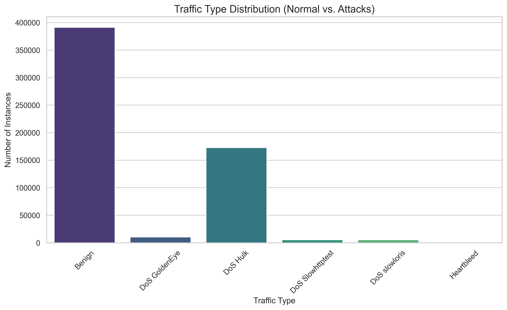
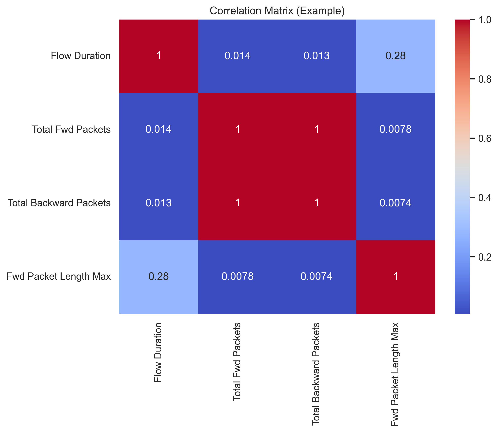
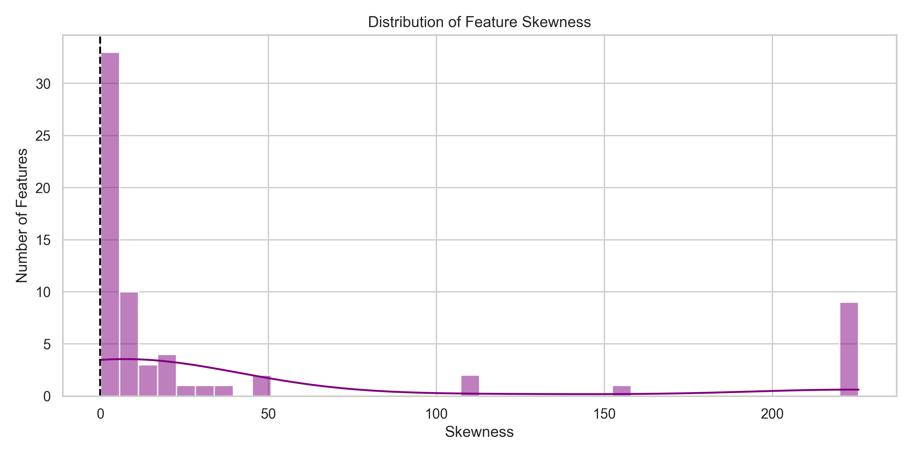

# Intrusion Detection System using Machine Learning
## DoS Attack Detection on Network Traffic

## Overview

This project implements a **machine learning-based Intrusion Detection System (IDS)** designed to detect **Denial-of-Service (DoS) attacks** in network traffic.

The system analyzes network flow statistics and classifies traffic as either **benign** or **malicious**, with additional experiments on **multi-class attack classification**.

The project follows a complete Data Science workflow:

1. Exploratory Data Analysis (EDA)
2. Data Cleaning
3. Feature Engineering
4. Model Training
5. Cross-Validation
6. Model Evaluation
7. Binary Attack Detection
8. ROC Analysis

The goal is to demonstrate how machine learning models can identify abnormal traffic patterns that indicate cyberattacks.

---

# Dataset

The dataset used is the **CIC DoS Wednesday dataset** from the **CICIDS2017 collection**.

It contains network flow statistics extracted from packet captures.

Each row represents a **network flow** with statistical features such as:

- Flow Duration
- Packet length statistics
- Forward / backward packet counts
- Flow bytes per second
- Flow packets per second
- TCP flags

## Traffic Classes

| Label | Description |
|---|---|
| Benign | Normal network traffic |
| DoS Hulk | High-rate HTTP flooding |
| DoS GoldenEye | Web server overload attack |
| DoS slowloris | Slow HTTP header attack |
| DoS Slowhttptest | Slow body attack |
| Heartbleed | TLS vulnerability exploitation |

**Note:** The dataset is highly imbalanced (≈66% Benign, ≈0.001% Heartbleed), requiring specialized techniques for imbalanced learning.



---

# Project Structure

```text
IDS_ML_Cybersecurity/
├── data/
│   ├── DoS-Wednesday-no-metadata.parquet
│   ├── DoS-Wednesday-CLEANED.parquet
│   ├── DoS-Wednesday-PROCESSED.parquet
│   └── highly_skewed_features.json
├── notebooks/
│   ├── 01_EDA_Cleaning.ipynb
│   ├── 02_Feature_Engineering.ipynb
│   └── 03_Model_Training.ipynb
└── README.md
```

---

# 1. Exploratory Data Analysis (EDA)

EDA was performed to understand:

- Class imbalance
- Feature distributions
- Correlations
- Data quality

### Dataset Size

```
Rows: ~584,000
Features: 78
```

### Class Distribution

| Traffic Type | Percentage |
|---|---|
| Benign | ~66% |
| DoS Hulk | ~29% |
| DoS GoldenEye | ~1.7% |
| DoS slowloris | ~0.9% |
| DoS Slowhttptest | ~0.9% |
| Heartbleed | ~0.001% |

The dataset is **highly imbalanced**, which is typical in cybersecurity datasets.

---

# 2. Data Cleaning

The following steps were applied:

## Missing Values

```
Missing values across all columns: 0
```

## Infinite Values

Some network features may produce infinite values.

```python
df.replace([np.inf, -np.inf], np.nan, inplace=True)
df.dropna(inplace=True)
```
## Correlaton Matrix



## Constant Feature Removal

Columns with zero variance provide no predictive value and were removed.

```python
constant_columns = [col for col in df.columns if df[col].nunique() <= 1]
df.drop(columns=constant_columns, inplace=True)
```

---

# 3. Feature Engineering

## Log Transformation


To reduce skewness in numerical features, a log transformation was applied:

$$
x' = log(1 + x)
$$

```python
df[col] = np.log1p(df[col])
```
This compresses extreme values and improves model learning.

---
## Label Encoding

The categorical labels were converted into numerical values:

| Class | Encoded Value |
|---|---|
| Benign | 0 |
| DoS GoldenEye | 1 |
| DoS Hulk | 2 |
| DoS slowloris | 3 |
| DoS Slowhttptest | 4 |
| Heartbleed | 5 |

---

# 4. Machine Learning Pipeline

The model was implemented using a **scikit-learn pipeline**.

### Pipeline Structure

```text
RobustScaler → SMOTE → RandomForestClassifier
```

### RobustScaler

SMOTE relies on **distance calculations**, so scaling helps prevent large features from dominating the distance metric.

### SMOTE

SMOTE (Synthetic Minority Oversampling Technique) generates synthetic samples for minority classes.

Due to the extremely small **Heartbleed** class, the parameter was adjusted:

```python
SMOTE(k_neighbors=1)
```

### Random Forest Classifier

The classifier used:

```python
RandomForestClassifier(
    n_estimators=200,
    random_state=42,
    n_jobs=-1
)
```

Random Forest was selected because it:

- Handles nonlinear relationships
- Is robust to outliers
- Performs well on tabular datasets

---

# 5. Cross Validation

Stratified K-Fold Cross Validation was applied.

```python
StratifiedKFold(n_splits=3)
```

Stratification ensures class distributions remain consistent across folds.

### Results

```text
CV scores: [0.9409, 0.9955, 0.9948]
Mean CV: 0.977
```

This indicates strong stability across different training splits.

---

# 6. Multi-Class Evaluation

### Classification Report

```text
Accuracy: 1.00
Macro F1-score: 0.99
Weighted F1-score: 1.00
```

The model performs extremely well across most classes.

However, the **Heartbleed** class contains extremely few samples, so its metrics are not statistically reliable.

---

# Confusion Matrix

The confusion matrix shows very few misclassifications.

Most errors occur between similar DoS attack types, which share comparable traffic characteristics.

---

# 7. Binary Attack Detection

To improve scientific validity, the dataset was also converted into a **binary classification problem**.

```text
0 → Benign
1 → Attack
```

This setup better reflects how real Intrusion Detection Systems typically operate.

---

# ROC Curve

The model achieved:

```text
AUC = 0.9999
```

This indicates **near-perfect separation between benign and malicious traffic**.

---

## Interpretation

The strong performance can be explained by:

- Distinct network flow patterns for **DoS attacks**
- Statistical traffic features capturing **abnormal behavior**
- Random Forest capturing **nonlinear relationships**

---

## Limitations

Despite strong performance, several limitations exist.

### Rare Attack Samples

The **Heartbleed** class contains extremely few samples, making evaluation unreliable.

### Synthetic Oversampling

**SMOTE** generates artificial samples that may not perfectly represent real attacks.

### Controlled Dataset

The **CICIDS dataset** was generated in a controlled environment and may not fully reflect real-world network traffic.

### Concept Drift

The model was not evaluated against **evolving attack patterns**, which are common in real cybersecurity environments.

---

## Future Improvements

Possible improvements include:

- Testing gradient boosting models (**XGBoost**, **LightGBM**)
- Hyperparameter tuning
- Feature importance analysis
- Real-time network monitoring integration
- Deployment in a streaming IDS pipeline

---

## Technologies Used

- Python
- Pandas
- NumPy
- Scikit-learn
- Imbalanced-learn
- Matplotlib
- Seaborn

---

## Skills Demonstrated

- Data preprocessing
- Handling imbalanced datasets
- Feature engineering
- Cross validation
- Model evaluation
- Cybersecurity data analysis

---

## Conclusion

This project demonstrates how **machine learning models can detect anomalous network behavior associated with DoS attacks**.

The **Random Forest model combined with SMOTE** achieved extremely strong performance on the CICIDS dataset while also highlighting important challenges such as **class imbalance** and **dataset realism**.

---

## Author

**Iulia Pincu**
